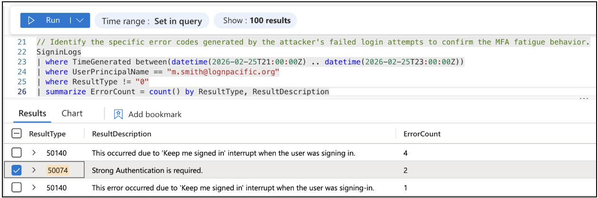
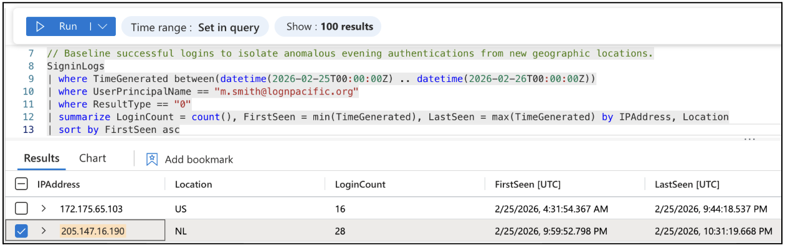
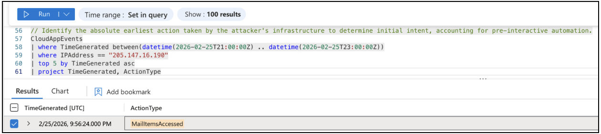
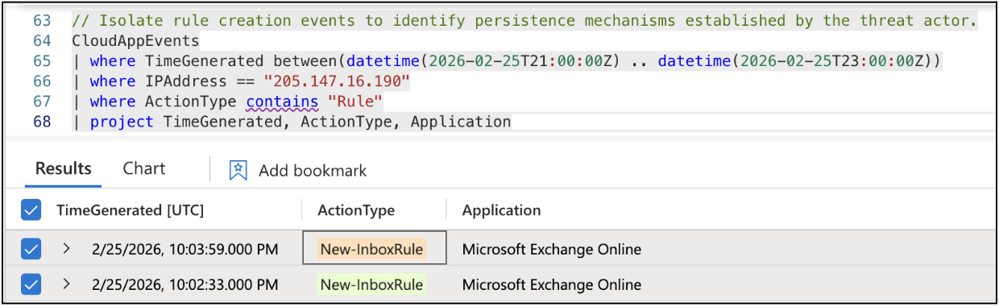
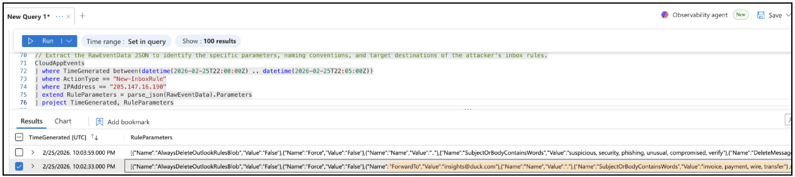
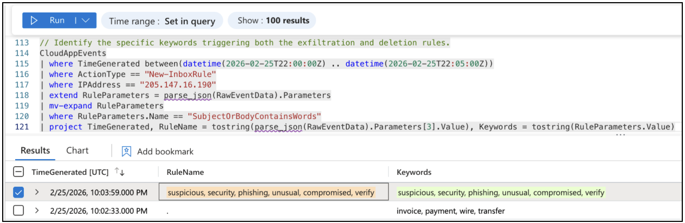
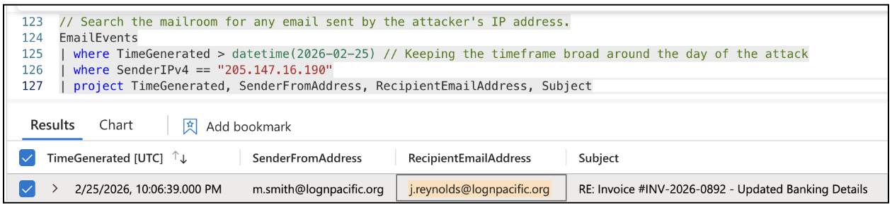
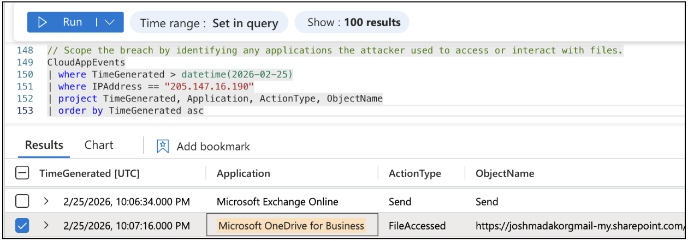
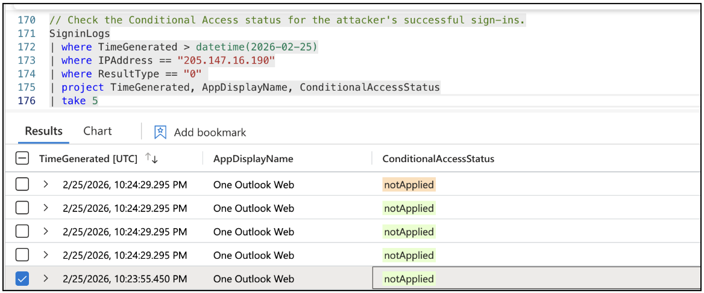

# Business Email Compromise (BEC) Investigation

## Overview

This project documents a Business Email Compromise (BEC) investigation using Microsoft Sentinel.

The attacker used stolen credentials and an MFA fatigue attack to gain access, create inbox rules, and execute a fraudulent invoice request.

---

## Key Skills Demonstrated

- Threat Hunting (KQL)
- Incident Response
- Log Correlation
- MITRE ATT&CK Mapping
- Cloud Security Analysis

---

## Executive Summary

A finance employee account was compromised after the user approved a malicious MFA request.

The attacker:
- Accessed email data
- Created inbox rules for persistence
- Forwarded sensitive emails externally
- Sent a fraudulent invoice email
- Accessed cloud storage (OneDrive)

A major issue identified:
> ❌ Conditional Access policies were not enforced

---

## Initial Access (MFA Fatigue)

The attacker triggered multiple MFA prompts until the user approved one.

---

## 🌍 Attacker Infrastructure

A foreign IP address was used to access the account.

- IP: 205.147.16.190  
- Location: Netherlands  

---

## Key Finding: Pre-MFA Mail Access

Mailbox activity occurred **before MFA approval**, indicating advanced attack behavior.

---

## Persistence (Inbox Rules)

The attacker created inbox rules to maintain access.

---

## Data Exfiltration

Sensitive emails were automatically forwarded to an external address.

---

## Defense Evasion

Security-related emails were deleted to avoid detection.

---

## BEC Attack Execution

A fraudulent invoice email was sent internally using a trusted conversation.

---

## Lateral Movement

The attacker accessed cloud storage after sending the fraudulent email.

---

## Root Cause

A critical security failure allowed the attack.

- No Conditional Access enforcement  
- MFA fatigue attack successful  
- Stolen credentials used  

---

## 🧭 MITRE ATT&CK Mapping

| Tactic | Technique | Description |
|-------|----------|-------------|
| Initial Access | T1078 – Valid Accounts | Attacker used stolen credentials to access the account |
| Credential Access | T1621 – Multi-Factor Authentication Request Generation | MFA fatigue attack used to gain access |
| Persistence | T1098 – Account Manipulation | Inbox rules created to maintain access |
| Defense Evasion | T1564.008 – Email Hiding Rules | Security-related emails deleted to avoid detection |
| Collection | T1114 – Email Collection | Attacker accessed and reviewed mailbox contents |
| Exfiltration | T1020 – Automated Exfiltration | Emails automatically forwarded to an external account |
| Impact | T1566.002 – Phishing (BEC) | Fraudulent invoice email sent using compromised account |

## Indicators of Compromise (IOCs)

- 205.147.16.190  
- insights@duck.com  
- Inbox Rules: ".", ".."  

---

## Recommendations

- Enforce Conditional Access
- Disable legacy authentication
- Use phishing-resistant MFA
- Monitor inbox rule creation
- Train users on MFA fatigue attacks

---

## Conclusion

This incident demonstrates how attackers can bypass MFA using social engineering and exploit weak identity controls to execute financial fraud and access sensitive data.

---

## 👤 Author

Jason Stokes  
Cybersecurity | Threat Hunting | Incident Response
